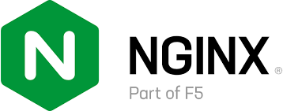

# Deliverable 1

> Tutorial can be found [here](https://www.digitalocean.com/community/tutorials/how-to-install-the-apache-web-server-on-ubuntu-22-04).

## Every concept I don’t understand research them.

* __UFW Firewall__ - Uncomplicated Firewall (UFW) is a program for managing a netfilter firewall designed to be easy to use. It uses a command-line interface consisting of a small number of simple commands, and uses iptables for configuration. UFW is available by default in all Ubuntu installations since 8.04 LTS.[1] 
* __systemd__ - Several Linux distributions control system settings and services using systemd.

    * _systemd_ divides activities into units and unit groups into targets to establish dependencies on other system services and resources.

    * _systemd_ can automatically boot the devices and targets, or if asked, the server already runs if a user or another systemd target.

* __init system__ - The systemctl command is the key management tool for init system control. We examine this command and discuss how services are managed, checked status, changed system statements, and configured files.
* __systemctl__ - The systemctl command utility interacts with systemd-controlled processes. It can look at and start, stop and change the state of units and objectives in your machine.
* __Virtual Hosts__ - The term Virtual Host refers to the practice of running more than one web site (such as company1.example.com and company2.example.com) on a single machine. Virtual hosts can be "IP-based", meaning that you have a different IP address for every web site, or "name-based", meaning that you have multiple names running on each IP address. The fact that they are running on the same physical server is not apparent to the end user.
* __Server Block__ - Server Blocks, often referred to as Nginx virtual host are a feature of the Nginx web server that allows you to host multiple websites on one server. As opposed to setting up and configuring a server for each domain, hosting a number of websites on a single machine saves both time and money. The same can be said for Apache servers or other servers.
  
* __a2ensite__ - _a2ensite_ is a script that configures apache2 to enable the provided site (which contains a block). It accomplishes this by generating symlinks in /etc/apache2/sites-enabled.

    * Similarly, _a2dissite_ deactivates a site by removing such symbolic connections. It is not an error to enable a site already in the stage of activation or to disable a site already kept in disable stage. It treats the default site differently: the resulting symlink is named 000-default in order to load first. Let us go though a short example on a2ensite apache.
  
### What is a web server? Hardware and software side

The term web server can refer to hardware or software, or both of them working together.

1. On the hardware side, a web server is a computer that stores web server software and a website's component files (for example, HTML documents, images, CSS stylesheets, and JavaScript files). A web server connects to the Internet and supports physical data interchange with other devices connected to the web.

2. On the software side, a web server includes several parts that control how web users access hosted files. At a minimum, this is an HTTP server. An HTTP server is software that understands URLs (web addresses) and HTTP (the protocol your browser uses to view webpages). An HTTP server can be accessed through the domain names of the websites it stores, and it delivers the content of these hosted websites to the end user's device.

At the most basic level, whenever a browser needs a file that is hosted on a web server, the browser requests the file via HTTP. When the request reaches the correct (hardware) web server, the (software) HTTP server accepts the request, finds the requested document, and sends it back to the browser, also through HTTP. (If the server doesn't find the requested document, it returns a 404 response instead.)

Basic representation of a client/server connection through HTTP
 
To publish a website, you need either a static or a dynamic web server.

A static web server, or stack, consists of a computer (hardware) with an HTTP server (software). We call it "static" because the server sends its hosted files as-is to your browser.

A dynamic web server consists of a static web server plus extra software, most commonly an application server and a database. We call it "dynamic" because the application server updates the hosted files before sending content to your browser via the HTTP server.

### What are some different web server applications?

Some of the most popular open source web servers available today:

| Apache | Nginx | Caddy | Lightttp | MonkeyServer | OpenLiteSpeed | Cherokee |
| ------ | ----- | ----- | -------- | ------------ | ------------- | -------- |
|  |  |  |  |  |  |  |

### What is virtualization?

Virtualization is the process of creating a software-based, or "virtual" version of a computer, with dedicated amounts of CPU, memory, and storage that are "borrowed" from a physical host computer—such as your personal computer— and/or a remote server—such as a server in a cloud provider's datacenter. A virtual machine is a computer file, typically called an image, that behaves like an actual computer. It can run in a window as a separate computing environment, often to run a different operating system—or even to function as the user's entire computer experience—as is common on many people's work computers. The virtual machine is partitioned from the rest of the system, meaning that the software inside a VM can't interfere with the host computer's primary operating system.

Virtualization creates a simulated, or virtual, computing environment as opposed to a physical environment. Virtualization often includes computer-generated versions of hardware, operating systems, storage devices, and more. This allows organizations to partition a single physical computer or server into several virtual machines. Each virtual machine can then interact independently and run different operating systems or applications while sharing the resources of a single host machine.

By creating multiple resources from a single computer or server, virtualization improves scalability and workloads while resulting in the use of fewer overall servers, less energy consumption, and less infrastructure costs and maintenance. There are four main categories virtualization falls into. The first is desktop virtualization, which allows one centralized server to deliver and manage individualized desktops. The second is network virtualization, designed to split network bandwidth into independent channels to then be assigned to specific servers or devices. The third category is software virtualization, which separates applications from the hardware and operating system. And the fourth is storage virtualization, which combines multiple network storage resources into a single storage device where multiple users may access it.

### What is virtualbox?

VirtualBox is a powerful x86 and AMD64/Intel64 virtualization product for enterprise as well as home use. Not only is VirtualBox an extremely feature rich, high performance product for enterprise customers, it is also the only professional solution that is freely available as Open Source Software under the terms of the GNU General Public License (GPL) version 3. See "About VirtualBox" for an introduction.

Presently, VirtualBox runs on Windows, Linux, Macintosh, and Solaris hosts and supports a large number of guest operating systems including but not limited to Windows (NT 4.0, 2000, XP, Server 2003, Vista, Windows 7, Windows 8, Windows 10), DOS/Windows 3.x, Linux (2.4, 2.6, 3.x and 4.x), Solaris and OpenSolaris, OS/2, and OpenBSD.

VirtualBox is being actively developed with frequent releases and has an ever growing list of features, supported guest operating systems and platforms it runs on. VirtualBox is a community effort backed by a dedicated company: everyone is encouraged to contribute while Oracle ensures the product always meets professional quality criteria

### What is a virtual machine?

A virtual machine, commonly shortened to just VM, is no different than any other physical computer like a laptop, smart phone, or server. It has a CPU, memory, disks to store your files, and can connect to the internet if needed. While the parts that make up your computer (called hardware) are physical and tangible, VMs are often thought of as virtual computers or software-defined computers within physical servers, existing only as code.

### What is Ubuntu Server?

Ubuntu Server is a part of the larger set of Ubuntu products and operating system developed by Canonical Ltd. Ubuntu server is a specific addition that differs a little bit from Ubuntu desktop, in order to facilitate installation on servers.

Ubuntu tools, which are open-source software, are alternatives to various types of licensed products. The word "Ubuntu" comes from a South African term for togetherness and sharing.
Some of the differences with Ubuntu Server include the replacement of a graphical user interface with a character-based interface for installation, as well as other changes to the interface. These can be customized by the user. The system is compatible with many different platforms like Microsoft Hyper-V and VMware ESX server. 

Ubuntu Server can be an easy and convenient way to set up a simple home network. One other feature of Ubuntu Server is the ability to assign "super user" tasks to make it easier to administer the network, where using the original edition can be more challenging or labor intensive.

### What is a firewall? 

A firewall is a network security device that monitors incoming and outgoing network traffic and decides whether to allow or block specific traffic based on a defined set of security rules.

Firewalls have been a first line of defense in network security for over 25 years. They establish a barrier between secured and controlled internal networks that can be trusted and untrusted outside networks, such as the Internet. 

A firewall can be hardware, software, software-as-a service (SaaS), public cloud, or private cloud (virtual).

### What is SSH?
SSH, also known as Secure Shell or Secure Socket Shell, is a network protocol that gives users, particularly system administrators, a secure way to access a computer over an unsecured network.

SSH also refers to the suite of utilities that implement the SSH protocol. Secure Shell provides strong password authentication and public key authentication, as well as encrypted data communications between two computers connecting over an open network, such as the internet.

In addition to providing strong encryption, SSH is widely used by network administrators to manage systems and applications remotely, enabling them to log in to another computer over a network, execute commands and move files from one computer to another.

SSH refers both to the cryptographic network protocol and to the suite of utilities that implement that protocol. SSH uses the client-server model, connecting a Secure Shell client application, which is the end where the session is displayed, with an SSH server, which is the end where the session runs. SSH implementations often include support for application protocols used for terminal emulation or file transfers.

SSH can also be used to create secure tunnels for other application protocols, for example, to securely run X Window System graphical sessions remotely. An SSH server, by default, listens on the standard Transmission Control Protocol (TCP) port 22.

###### What is SSH used for?
Present in all data centers, SSH ships by default with every Unix, Linux and Mac server. SSH connections have been used to secure many different types of communications between a local machine and a remote host, including secure remote access to resources, remote execution of commands, delivery of software patches, and updates and other administrative or management tasks.

In addition to creating a secure channel between local and remote computers, SSH is used to manage routers, server hardware, virtualization platforms, operating systems (OSes), and inside systems management and file transfer applications.

Secure Shell is used to connect to servers, make changes, perform uploads and exit, either using tools or directly through the terminal. SSH keys can be employed to automate access to servers and often are used in scripts, backup systems and configuration management tools.

Designed to be convenient and work across organizational boundaries, SSH keys provide single sign-on (SSO) so that users can move between their accounts without typing a password each time.

While playing pivotal roles in identity management and access management, SSH does more than authenticate over an encrypted connection. All SSH traffic is encrypted. Whether users are transferring a file, browsing the web or running a command, their actions are private.

While it is possible to use SSH with an ordinary user ID and password as credentials, SSH relies more often on public key pairs to authenticate hosts to each other. Individual users must still employ their user ID and password -- or other authentication methods -- to connect to the remote host itself, but the local machine and the remote machine authenticate separately to each other. This is accomplished by generating a unique public key pair for each host in the communication. A single session requires two public key pairs: one public key pair to authenticate the remote machine to the local machine and a second public key pair to authenticate the local machine to the remote machine.

###### Secure Shell capabilities
Functions that SSH enables include the following:

secure remote access to SSH-enabled network systems or devices for users, as well as automated processes;
secure and interactive file transfer sessions;
automated and secured file transfers;
secure issuance of commands on remote devices or systems; and
secure management of network infrastructure components.
SSH can be used interactively to enable terminal sessions and should be used instead of the less secure Telnet program. SSH is also commonly used in scripts and other software to enable programs and systems to remotely and securely access data and other resources.

###### How does SSH work?
Secure Shell was created to replace insecure terminal emulation or login programs, such as Telnet, rlogin (remote login) and rsh (remote shell). SSH enables the same functions -- logging in to and running terminal sessions on remote systems. SSH also replaces file transfer programs, such as File Transfer Protocol (FTP) and rcp (remote copy).

The most basic use of SSH is to connect to a remote host for a terminal session. The form of that command is the following:

> ssh UserName@SSHserver.example.com

This command will cause the client to attempt to connect to the server named server.example.com, using the user ID UserName. If this is the first time negotiating a connection between the local host and the server, the user will be prompted with the remote host's public key fingerprint and prompted to connect, despite there having been no prior connection:

The authenticity of host 'sample.ssh.com' cannot be established.
 > DSA key fingerprint is 01:23:45:67:89:ab:cd:ef:ff:fe:dc:ba:98:76:54:32:10.
 Are you sure you want to continue connecting (yes/no)?
Answering yes to the prompt will cause the session to continue, and the host key is stored in the local system's known_hosts file. This is a hidden file, stored by default in a hidden directory, called /.ssh/known_hosts, in the user's home directory. Once the host key has been stored in the known_hosts file, the client system can connect directly to that server again without need for any approvals; the host key authenticates the connection.

