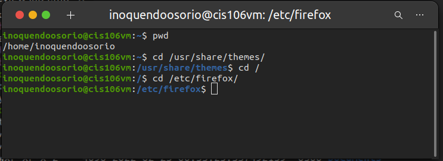
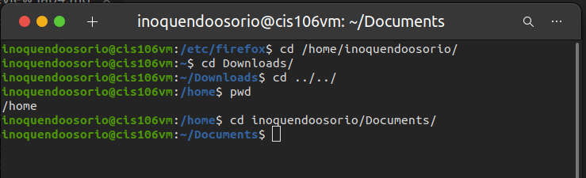
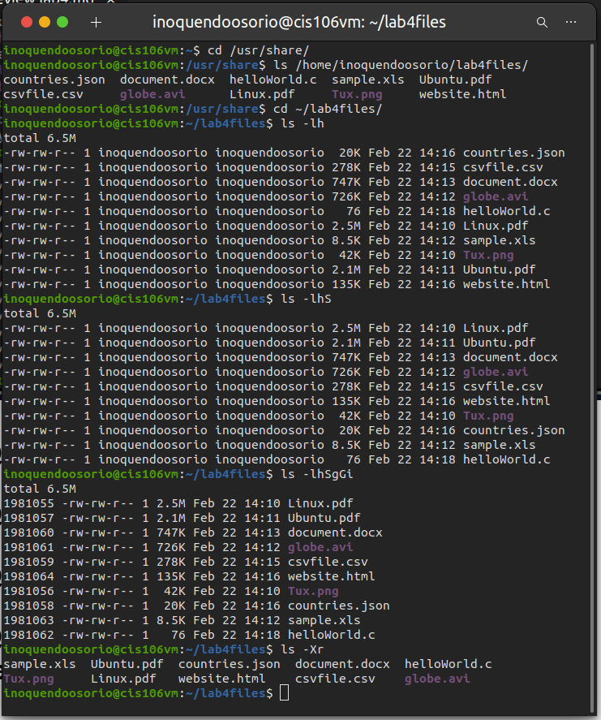
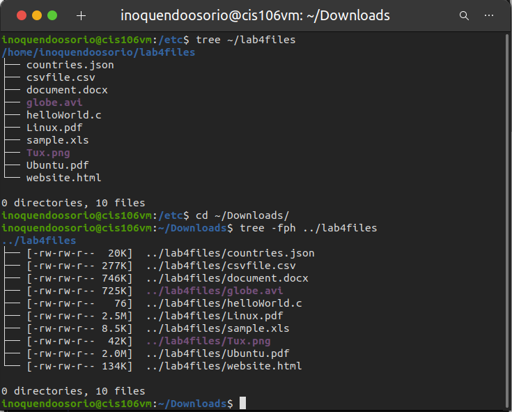
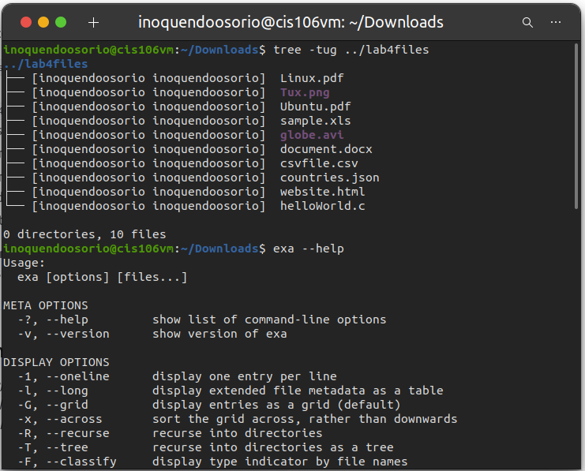
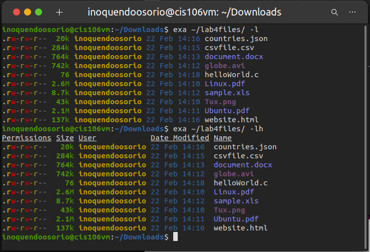
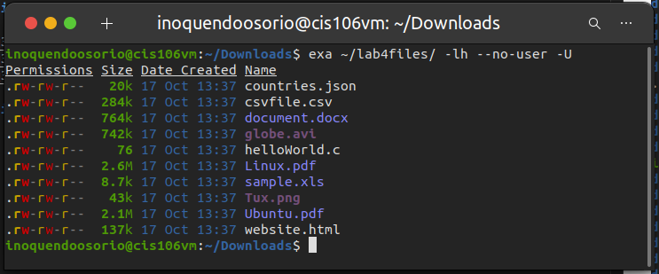
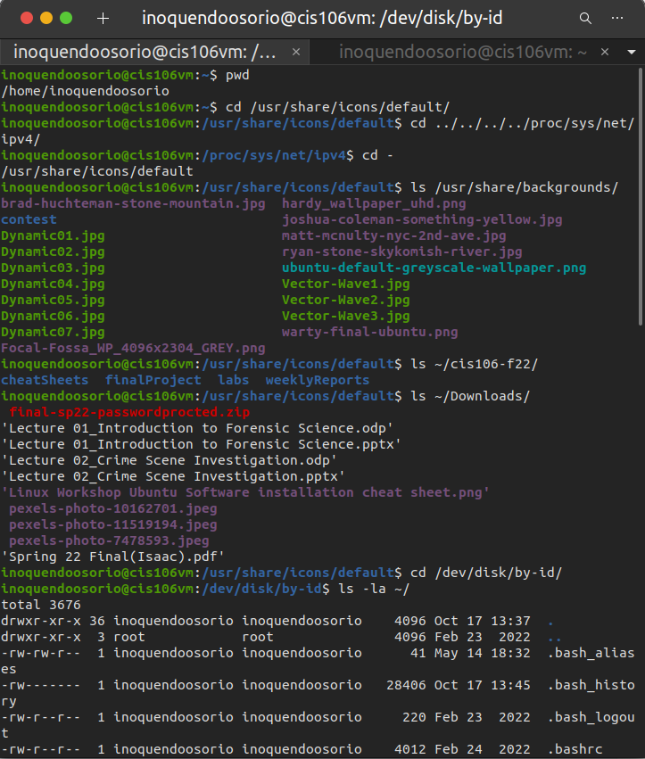

# Lab 4

### Question 1: | The pwd and cd commands to move around the file system.

### Question 2 | The ls command 

### Question 3 | The tree & exa command. A modern tool to replace ls command. 

### Question 4 | Challenge Question

