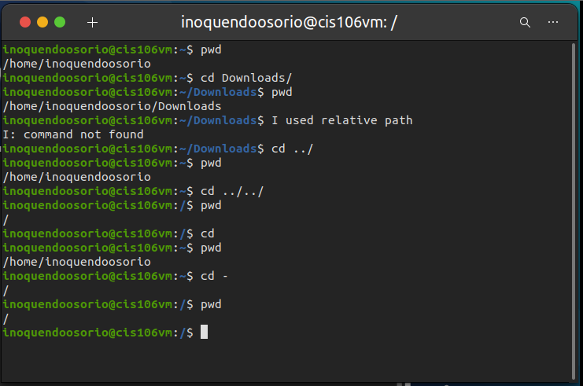
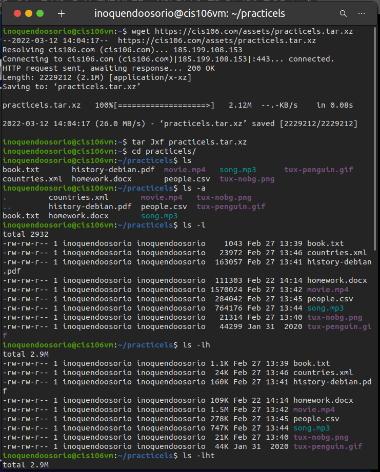
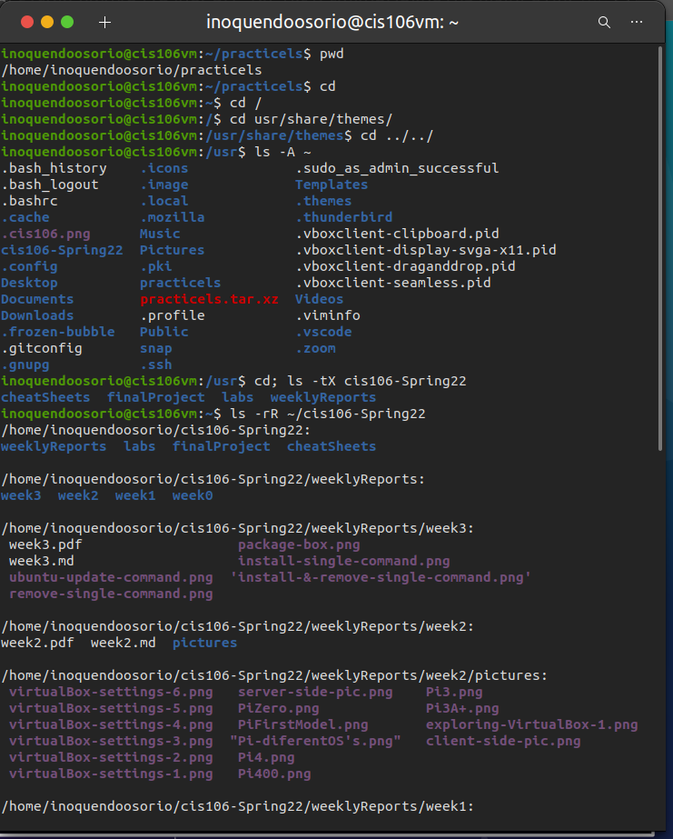

# Week Report 4

### Practices

   

---

### The linux filesystem

**Create a table that includes the following directories and their usage:**
#### Table1
| Directory | Function                                                          |
| --------- | ----------------------------------------------------------------- |
| bin       | Essential commands                                                |
| dev       | Device files                                                      |
| etc       | System configuration files                                        |
| home      | User home directories                                             |
| media     | Mount point for removable media, such as DVDs and floppy disks    |
| opt       | Add-on software packages                                          |
| proc      | Kernel information, process control system hardware information   |
| srv       | Information relating to services that run on the system           |
| usr       | Software not essential for system operation, such as applications |

### Commands to navigate the filesystem
#### Table2
**Create a table of the commands used for navigating the file system. You have to use code formatting in your markdown just like the example. Your table must include the following:**

| Command | What it does                                                                                                                                                | Syntax                           | Example                                       |
| ------- | ----------------------------------------------------------------------------------------------------------------------------------------------------------- | -------------------------------- | --------------------------------------------- |
| pwd     | Used for displaying the current working directory.                                                                                                          | `pwd`                            | Ex. `pwd`                                     |
| cd      | Used for changing the current working directory. When no directory is given, cd changes the current working directory to the current user's home directory. | `cd + destination`               | Ex. `cd ~/Downloads/`                         |
| ls      | Used for displaying all the files inside a given directory. When no directory is specified, ls displays the files in the current working directory.         | `ls + option + directory name`   | Ex. `ls -lah ~/cis106-Spring22/cheatSheets/ ` |
| tree    | list all the files and directories in a given directory in a nice tree like format                                                                          | `tree + option + directory name` | Ex. `tree -l ~/Pictures/`                     |

#### Definitions of the following terms

_**File system**_ - The way files are stored and organized to simplify access to data. 
_**Current directory**_ - The directory were you are at the moment. AKA the present working directory. 
_**Parent directory**_ - A particular directory that has other subdirectories. 
_**Explain the difference between your home directory and the home directory**_ - These two sentences will express the difference:  
    * The phrase "_your home directory_" refers to your user's home directory. For example: `/home/isaac` is the home directory of the user isaac.
    * The phrase "_the home directory_" refers to the home directory located in the root. This: `/home`  
_**Pathname**_ - A path which indicates the location of a file in the file system. (Like an address). 
_**Relative path**_ - The location of a file starting from the current working directory or a directory that is located inside the current working directory. 
_**Absolute path**_ - The location of a file starting at the root of the file system.
 

**What is the right to repair movement and why does it matter?**
 
The right to repair is the movement that pretends create awareness to electronics consumers about their right to repair their electronic products using the schematics of a product if provided. Many companies are now omitting the inclusion of these schematics in their products and customers feel forced to them back to the place they bought it from. Aside from this previous mentioned issue, some of this companies are taking advantage by increasing the prices of the services on these products, making it even more hard on customers. 

This issue matters to us because it helps bring the community together with a common goal to stop other possible companies from doing the same thing. Also, it helps take the proper political measurements to try to get a solution to the existing entities that are practicing this "selfish monopoly"