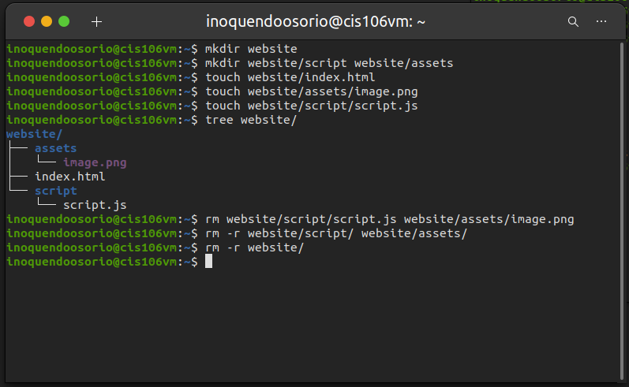

# Week Report 5

### What are command Options?
Command options are used to modify/enhance the command's behavior.

### What are command arguments?
Command arguments are the inputs/items on which the command acts on.

| Question | Definition | Usage | Example |
| ----- | ----- | ----- | ----- |
| **Which command is used for creating directories? Provide at least 3 examples.** |`mkdir` is a command used for creating a single directories or multiple directories.| To create a directory with `mkdir` type: `mkdir` + **the name of the directory** | - `mkdir` `-p` `website/assets/{img,videos,music}`   - `mkdir` `pictures`  - `mkdir` `school` |
| **What does the touch command do? Provide at least 3 examples.** | `touch` is a command used to create files and updates the given file's timestamp. If the file does not exit, it creates a new file | To create a file type:`touch` + **the name of the file** | - `touch` `shopping_lists.txt `   - `touch` `doc1.docx`   - `touch` `slides.ppt` |
| **How do you remove a file? Provide and example.** | `rm` is a command to used remove files. | To remove a file type: `rm` + **file to be removed** | - `rm` `website/index.html`   - `rm`  `website/assets/image.png`   - `rm` `shopping_lists.txt`|
| **How can you remove a directory and can you remove a non-empty directory in Linux? Provide an example.** |`rmdir` is a command used to remove empty directories. `rmdir` by default does not remove NON-empty directories. To remove a NON-empty directory use `-r` option. | To remove empty directories use `rmdir` + **directory to be removed.** To remove a non-empty directory type: `rm` `-r`+ **directory to be removed**  |- `rm` `-r` `website/assets/music/`   - `rmdir` `pictures/`  |
| **Explain the mv command. Provide at least 2 examples of each.** |`mv` is a command use to move and rename directories. Where source is the file or directory that you want to move and destination is where the directory or file is going. Both, source and destination can be either absolute or relative path. | The basic formula of the `mv` command is: `mv` + **source + destination** | To move a file of a directory to another directory use: - `mv` `/Downloads/week5.md cis106-spring/week5`   - `mv` `~/Downloads/Photos ~/Pictures/` |
| **Explain the cp command. Provide at least 2 examples of each.** |`cp` is a command used to copy file/directories from a source to a destination. | The `cp` command uses the same structure as the `mv` command: `cp`+ **file/directory to copy + destination** | - `cp` `/Downloads/wallpapers/ Pictures/wallpapers/`   - `cp` `Downloads/sample1.docx` `website/docs/` | 

      

## Practice 

**Practice 1**
  

**Practice 2**
  
  
**Practice 3**
 
  
  
**Practice 4**

  