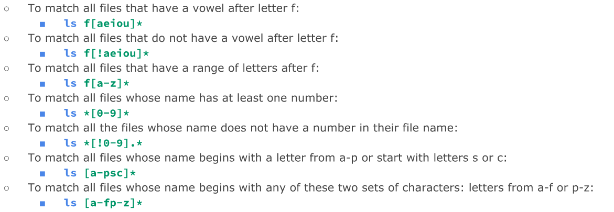

# Week Report 6

> Instructions:

>   Weekly Report must include the following:
        Wildcards. At least 3 examples per wildcard (*,?,[])

>    Complete all the practice in the presentation and take screenshots after you complete each practice.
        * Practice 5
        * Practice 6
        * Practice 7
>    Brace expansion and how to use it. At least 3 examples

## Wildcards

### The * Wildcard

The `*` Wildcard matches zero or any number of characters in a filename.

* Examples:

### The ? Wildcard

The `?` Wildcard matches precisely one character in a filename. It is very useful when working with hidden files.

* Examples:

### The [] Wildcard

The `[]` Wildcard matches a single character in a range. The brackets wildcard `[]` can use the exclamation mark `!` to reverse the match.

* Examples:

### Using Brace Expansion 

Brace expansion is not a wildcard, but another feature of the bash shell that allows you to generate arbitrary strings to use with commands.

* Examples:

# Practices:

### Practice 5

### Practice 6 

### Practice 7

### Bonus \{brace expansion}

